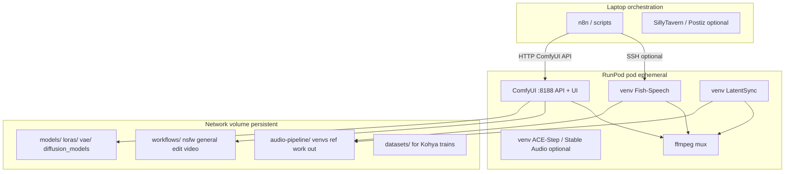

## Relations

@runbooks/runpod-comfyui-setup.md @concepts/model-selection-workflow.md @concepts/persona-audio-stack.md @concepts/persona-ops-stack.md @concepts/video-identity-inheritance.md @concepts/de-censoring-techniques.md @entities/hardware/gpu-guide.md @entities/uis/comfyui.md @entities/models/wan-2-2.md @entities/models/flux-2-klein.md

## Raw Concept

Operator goal: **spin up a full CUDA stack on RunPod in under an hour** (often ~15–30 minutes after the first bootstrap), for **NSFW persona work**, **general content creation**, or **heavy image/video edit/generate** — without re-downloading weights or re-cloning nodes every session.

This runbook is the **architecture + bring-up contract**. Node install details stay in @runbooks/runpod-comfyui-setup.md. Audio CLI sequencing stays in `briefs/2026-05-19_audio-pipeline-runbook.md` (gitignored brief; mirror commands from @concepts/persona-audio-stack.md).

## Narrative

### Quick start

Tracked copy of the deploy checklist. `briefs/` stays local and is not in git.

**Before the first pod**

- RunPod account and a spend alert.
- Network volume **500 GB–1 TB** in a datacenter that has a **4090**. Secure Cloud 4090 was **$0.74/hr** with **LOW** stock in `EU-CZ-1`, `EU-RO-1`, `EUR-IS-1`, `EUR-IS-2`, `EUR-NO-1`, and `US-IL-1` on 2026-09-24. Re-read stock before you create. Community 4090 was **NONE** that same read.
- Put `HF_TOKEN` and `CIVITAI_API_TOKEN` in RunPod secrets. Do not put them in git or chat.

**One-time bootstrap**

1. ComfyUI template pod with the volume mounted at `/workspace`.
2. Copy `scripts/runpod/bringup.sh` to the pod and run it. It creates the folder tree, clones the core custom nodes, and writes `healthcheck.sh`.
3. Reboot. In ComfyUI Manager, install missing custom nodes.
4. Download the shared base: FLUX.2 Klein, Wan 2.2 **5B** (not native 14B 720p), Fish-Speech, LatentSync, plus a small prompt model (SmolLM2-1.7B or Qwen ~4B GGUF). Unload that prompt model before the sampler.
5. Save graphs under `/workspace/workflows/{nsfw,general,edit,video}/`.
6. Run `bash /workspace/bin/healthcheck.sh`.

**Each session**

1. Start the pod on the **same** volume and datacenter.
2. Confirm ComfyUI listens on `0.0.0.0:8188`. Prefer an SSH or Tailscale tunnel. The public proxy URL changes every start and has no login.
3. Smoke test: one 512² still and one short Wan 5B clip.
4. Call ComfyUI `POST /free` before Fish-Speech or LatentSync.

**Pick a profile** (same volume)

| Say | Script | Workflow folder |
|-----|--------|-----------------|
| Profile A | `scripts/runpod/switch_profile.sh A` | `workflows/nsfw/` |
| Profile B | `scripts/runpod/switch_profile.sh B` | `workflows/general/` |
| Profile C | `scripts/runpod/switch_profile.sh C` | `workflows/edit/` and `workflows/video/` |

Profile B must not load `models/loras/nsfw/`. Profile A needs your character LoRA and a reference voice you own. Stop the pod when idle. The volume keeps billing until you delete it.

### Design principles

1. **One persistent network volume** holds models, LoRAs, workflows, and sidecar venvs. The pod is disposable; the volume is the product.
2. **ComfyUI is the hub** for image + video + most editing. Audio stays in **separate venvs** on the same GPU (sequential jobs, not parallel) unless you rent a second pod.
3. **Profile = model bundle + workflow folder**, not a different infrastructure stack. Same volume, same template; swap checkpoints and JSON graphs.
4. **Laptop orchestrates** (n8n, Postiz, SillyTavern, batch scripts). Do not run n8n on the GPU pod — it wastes VRAM and complicates restarts.
5. **Secrets live in RunPod secrets / env**, never in wiki or git. CivitAI token, HF token, API keys only on the pod at runtime.
6. **Volume and pod share one datacenter.** Network volumes are region-locked; a 4090 in another region cannot attach. Pick the region before you size the volume.
7. **VRAM handoff is explicit.** “Sequential” means unload ComfyUI weights (`POST /free` with unload flags) or stop ComfyUI before Fish-Speech / LatentSync — not merely queue order.
8. **Host policy gate.** RunPod and other hosts publish prohibited-content rules. NSFW persona work is build-track locally but **can violate host ToS**; keep an alternate host or bare-metal plan and offsite backups. Not legal advice — see @concepts/persona-legal-landscape.md.

### Architecture (steady state)



### Network volume layout (canonical paths)

Mount the volume at **`/workspace`** (RunPod default for ComfyUI templates). Use this tree so every runbook and script agrees:

| Path | Purpose |
|------|---------|
| `/workspace/ComfyUI/` | ComfyUI install + `custom_nodes/` |
| `/workspace/ComfyUI/models/` | Symlink or direct store for checkpoints, LoRAs, VAE, CLIP, diffusion_models, gguf |
| `/workspace/workflows/` | Exported JSON: `nsfw/`, `general/`, `edit/`, `video/`, `train/` |
| `/workspace/audio-pipeline/` | Sidecar stack per audio brief: `.venv-fish`, `.venv-latentsync`, `models/`, `ref/`, `work/`, `out/` |
| `/workspace/datasets/` | LoRA training images + captions |
| `/workspace/outputs/` | Dated renders before sync to laptop (optional rsync/scp) |
| `/workspace/bin/healthcheck.sh` | Smoke test script (see below) |
| `/workspace/.volume-id` | Sentinel file (UUID written at bootstrap) — fail if missing |
| `/workspace/lockfile.json` | ComfyUI commit, custom-node SHAs, model URL + size/hash |
| `/workspace/hf-cache/` | `HF_HOME` — avoid duplicate HF downloads |
| `/workspace/ComfyUI/models/loras/{nsfw,general}/` | Hard separation for Profile A vs B |
| `/workspace/ComfyUI/models/text_encoders/{raw,decensored}/` | Encoder A/B tagging |

**Disk budget:** plan **500 GB–1 TB** for a full stack (FLUX + Wan 5B/14B weights + LoRAs + audio models). A minimal Profile B can start near **200 GB** and grow. See @entities/hardware/gpu-guide.md.

**Bootstrap download lane:** attach the volume to a **CPU pod** in the same region for large manifest pulls (`hf_transfer`, resumable CivitAI/HF), then start the GPU pod — saves GPU-hour burn during first fill.

### GPU tier matrix (pick pod at deploy time)

**RTX 4090 24 GB is the default SKU** for Profile A video + sequential audio. Use **16 GB** pods only for Klein-only or SDXL-only sessions.

| Workload | VRAM floor | On RTX 4090 24 GB | Notes |
|----------|------------|---------------------|--------|
| SDXL / Pony / NoobAI stills | 8–12 GB | Yes | 16 GB tier is enough; 4090 is headroom |
| FLUX.2 Klein 9B | 14–16 GB (FP8/GGUF) | Yes | FP8 + encoders + upscale can need full 24 GB |
| FLUX.1 Dev + PuLID + Impact | 24 GB+ | **FP8/GGUF Q8 only** | FP16 Dev alone can fill 24 GB; split face-fix pass or use 32 GB (5090/L40S) |
| Wan 2.2 **TI2V-5B** 720p short clips | ~12–24 GB | Yes | Primary 4090 video path per @entities/models/wan-2-2.md |
| Wan 2.2 **A14B** 720p | 65–80 GB native BF16 | **FP8 + block swap, short clips only** | Do not label “720p A14B native” on 24 GB |
| HunyuanVideo 1.5 short 720p FP8 | ~24 GB | Possible for short clips | 48–80 GB for long 1080p / 13B-class native |
| LoRA train SDXL | 12–16 GB | Yes | Kohya on volume `datasets/` |
| LoRA train FLUX | ~20–24 GB | QLoRA / 8-bit optimizers | Full FP16 FLUX LoRA is tight on 24 GB |
| Fish-Speech + LatentSync | 6–10 GB each | Yes **after ComfyUI unload** | Concurrent ComfyUI + audio = OOM |
| LTX-2 / Qwen-Image (Profile B) | ~19–22 GB FP8 | Borderline | Lighter video option when license fits |
| Multi-GPU Wan (ChituDiffusion / SVOO) | 2×80 GB | No | Future factory path; 4090 has no NVLink |

**Fallback ladder when 4090 is unavailable:** RTX 5090 32 GB → L40S/A6000 48 GB — relax quantization rows accordingly.

### Prompt director (socials 2026-09-24)

Do **not** put a 27B 8-bit chat model on the 4090 next to Wan or FLUX. Community pattern: a **small** local LLM inside ComfyUI expands a short brief, then **unloads** before the sampler.

| Slot | Default |
|------|---------|
| Text brief → prompt | SmolLM2-1.7B or Qwen ~4B GGUF (Comfy node or llama.cpp). **Watch** @entities/models/wanpe.md for Wan-specific cinematic expander when weights ship |
| Image → prompt (Profile C) | Qwen3-VL ~8B, then unload |
| Diffusion text encoder | Separate from the director. Optional abliterated Qwen3-4B / Qwen3-VL-8B on Z-Image or Qwen-Image only |
| Persona chat | SillyTavern + ~13B Q4 on the laptop. Not required to run a profile |

### Operator contract (after the volume exists)

You name **A**, **B**, or **C**. The agent runs `scripts/runpod/switch_profile.sh` on the pod, restarts ComfyUI, and queues that profile’s workflow. That command does not download weights and does not create the volume.

### Three deployment profiles (same infra, different bundles)

Use **one volume**; label workflows and model folders by profile.

#### Profile A — NSFW / uncensored persona (build-track default)

**Goal:** Consistent character stills → short video → voice + lipsync → muxed clips for persona channels.

| Layer | Primary choice | Wiki anchor |
|-------|----------------|-------------|
| Stills T2I | Pony V6 / NoobAI-XL / Illustrious + character LoRA | @entities/models/pony-v6.md, @concepts/reference-plus-lora-stacking.md |
| Stills photoreal | FLUX.2 Klein 9B (FP8) + NSFW LoRA ecosystem | @entities/models/flux-2-klein.md, @concepts/de-censoring-techniques.md |
| Identity lock | **Pony/NoobAI:** IP-Adapter Plus. **Klein photoreal:** face-swap / MatchingPose path. **PuLID:** FLUX.1 Dev graphs only (not Klein) | @entities/adapters/pulid.md, @entities/adapters/flux2-klein-9b-faceswap.md |
| Video | Wan 2.2 I2V from master still | @entities/models/wan-2-2.md, @concepts/video-identity-inheritance.md |
| Voice | Fish-Speech S2 Pro | @entities/persona-ops/fish-speech.md |
| Lipsync | LatentSync 1.6 | @entities/lipsync/latentsync.md |
| Music / SFX optional | ACE-Step + Stable Audio Open | @concepts/persona-audio-stack.md |

**NSFW-specific ops (not legal advice):** use **local open weights** and operator-owned reference audio. Cloud APIs (ElevenLabs, Suno) are ToS-restricted for explicit content. See @concepts/censorship-tier-taxonomy.md and @concepts/persona-legal-landscape.md.

**Abliterated / de-censored text encoders:** treat as **optional experimental** encoders in ComfyUI; keep base checkpoints on volume tagged `raw` vs `decensored` so you can A/B without mixing graphs.

#### Profile B — General content creation (SFW-leaning, same stack)

**Goal:** Marketing visuals, b-roll, product shots, talking-head explainers without betting on NSFW LoRAs.

| Layer | Primary choice | Swap from Profile A |
|-------|----------------|---------------------|
| Stills | FLUX.2 Klein / Qwen-Image / Z-Image Turbo | Drop Pony unless stylized |
| Video | Wan 2.2 or LTX-2 where license fits | Same ComfyUI video nodes |
| Voice | Fish-Speech or CosyVoice2 | Same sidecar layout |
| Lipsync | LatentSync or MuseTalk | MuseTalk for faster draft quality |

Workflow JSON lives under `/workspace/workflows/general/`. Point Load LoRA nodes at `models/loras/general/` only. Prefer a **client license manifest** or graph assertion over folder discipline alone — wrong paths fail silently.

#### Profile C — Edit-heavy (image + video manipulation)

**Goal:** Inpaint, outpainting, identity-preserving edit, instruction-based video change, upscale, face fix.

| Capability | ComfyUI direction | Notes |
|------------|-------------------|--------|
| Still edit | FLUX Kontext / Redux / inpaint ControlNet | @entities/adapters/flux-kontext.md |
| Face fix / regional | Impact Pack + BMAB | @entities/custom-nodes/impact-pack.md |
| Video edit / extend | Wan img2vid, VideoHelperSuite, latent chaining | @concepts/seam-stitching-strategies.md |
| Instruction video edit | Track VideoX-Qwen, Sidecar-style reuse when weights/nodes ship | @entities/models/videox-qwen.md |
| Upscale | Ultimate SD Upscale / dedicated upscale checkpoints | Standard ComfyUI graphs |

Store graphs under `/workspace/workflows/edit/` and `/workspace/workflows/video/`. Profile C often **shares** Profile B checkpoints but adds ControlNet + mask-heavy graphs. Run Impact + upscale as a **second pass** after unloading video weights; pin Impact/BMAB node versions in `lockfile.json`.

### Bootstrap vs bring-up

#### Phase 0 — One-time bootstrap (2–4 hours, once per volume)

1. Create RunPod **network volume** (200 GB+).
2. Deploy **ComfyUI template** pod with volume attached at `/workspace`.
3. Run custom node install from @runbooks/runpod-comfyui-setup.md (`setup_nodes.sh`).
4. Reboot pod; Manager → **Install Missing Custom Nodes**.
5. Download **core model manifest** (below) into `/workspace/ComfyUI/models/`.
6. Clone audio sidecar layout under `/workspace/audio-pipeline/` (audio brief §0–1).
7. Export and save baseline workflows to `/workspace/workflows/{profile}/`.
8. Write `/workspace/.volume-id`, `/workspace/lockfile.json`, and `/workspace/bin/{healthcheck,bringup}.sh`; run until green. Copy `scripts/runpod/bringup.sh` and `scripts/runpod/switch_profile.sh` to `/workspace/bin/` and run them on the pod.
9. Optional: `restic`/`rclone` backup job for volume → object storage (operator bucket).

**Container vs volume:** ComfyUI core and Manager `pip` installs often live in the **container**. Pin a ComfyUI venv on the volume or re-run `bringup.sh` after every template change so custom nodes do not drift.

#### Phase 1 — Recurring bring-up (~15–30 min)

1. Start pod from template; attach **same network volume**.
2. Confirm `nvidia-smi` and disk free on volume.
3. Start ComfyUI: `listen 0.0.0.0` (template usually does this).
4. Run `bash /workspace/bin/healthcheck.sh`.
5. Open profile workflow; run 512² still + 2 s video smoke test.
6. Refresh automation URL — RunPod proxy host **changes every start**. Update n8n credential or use RunPod API / stable SSH tunnel (Tailscale). Treat public `:8188` proxy as **unauthenticated**; prefer tunnel for NSFW workloads.
7. Run `bash /workspace/bin/bringup.sh` (idempotent: nodes, deps, manifest verify).

Optional: `switch_profile.sh A|B|C` sets LoRA roots + `NSFW_MODE` env and restarts ComfyUI — single operator entry point.

### Core model manifest (standard bundle)

Adjust per profile; this is the **4090-friendly** default:

| Slot | NSFW persona default | General default |
|------|----------------------|-----------------|
| SDXL checkpoint | Pony V6 or NoobAI-XL | — |
| DiT checkpoint | FLUX.2 Klein 9B FP8/GGUF | Same |
| Video | Wan 2.2 weights + VAE/CLIP bundle | Same or LTX-2 |
| Voice | Fish-Speech S2 Pro | Same or CosyVoice2 |
| Lipsync | LatentSync | MuseTalk optional |

Download via HF CLI or CivitAI with token in env: `CIVITAI_API_TOKEN`, `HF_TOKEN`. Never commit tokens. Store a JSON **manifest** (URL, path, expected size, sha256) and verify on bootstrap — partial downloads cause silent corrupt `.safetensors`.

### Automation contract (laptop → pod)

| Step | Interface |
|------|-----------|
| Queue still / video job | ComfyUI **API** (`POST /prompt`) with workflow JSON |
| Poll completion | WebSocket or `/history` |
| Voice render | SSH + activate `.venv-fish`, run CLI |
| Lipsync | SSH + `.venv-latentsync` on `work/voice.wav` + driving video from ComfyUI |
| Final mux | `ffmpeg` on pod (see audio brief paths) |
| Publish | Laptop moves files from `/workspace/outputs/` — not from ephemeral pod disk |

@entities/persona-ops/n8n.md shows parallel ComfyUI + Fish branches — on **one 4090** that pattern **OOMs**. Serialize: ComfyUI job → `/free` unload → Fish → LatentSync → FFmpeg. Use full venv python paths in SSH (`/workspace/audio-pipeline/.venv-fish/bin/python`), not bare `source activate` in non-interactive n8n.

### Automation failure modes (production)

| Failure | Symptom | Mitigation |
|---------|---------|------------|
| Stale proxy URL | n8n timeouts | Refresh credential each bring-up; or tunnel |
| Volume not mounted / wrong DC | Writes vanish on stop | Require `/workspace/.volume-id` in healthcheck |
| ComfyUI + audio concurrent | CUDA OOM | Single-flight lock; GPU used &lt; 2 GB before audio |
| Manager mid-job restart | Poll hangs | Job timeout; check `/history` error fields |
| Spot preemption | Hours lost on Wan | On-demand for long video; spot for batch stills / LoRA |
| Disk full | Crash mid-render | Free-space floor in healthcheck before queue |
| Token in shell history | CivitAI leak | Use env vars + HF CLI login, not `wget ?token=` in shared history |
| Audio venv CUDA false | CPU TTS 30+ min | healthcheck: `torch.cuda.is_available()` inside each venv |
| GitHub 429 on nodes | Missing nodes after bring-up | Pin SHAs in lockfile; retry with tokenized git |

### Cost and safety guardrails

- **Stop pod** when idle; volume billing is storage-only.
- Set RunPod **max spend** alerts in console.
- One volume per operator (no shared CivitAI HF keys on shared volumes).
- **No LIVE platform automation** from agent sessions without explicit OK (persona ops).
- Right-of-publicity: only operator-owned or licensed reference faces/voices.

### Future upgrades (watch list, not required day one)

| Signal | When to expand stack |
|--------|----------------------|
| @entities/models/quantwm.md + @entities/models/ar-video-memory.md | Long AR video; 2-bit KV + memory nodes when integrated in Wan graphs |
| ChituDiffusion / multi-GPU | High-volume video factory on 2×A100 |
| ComfyUI native audio nodes | Re-evaluate sidecar venvs if nodes mature (@concepts/persona-audio-stack.md) |
| RunPod serverless | Short Fal-like bursts — different from persistent ComfyUI volume pattern |

### healthcheck.sh (recommended)

```bash
#!/bin/bash
set -e
test -f /workspace/.volume-id || { echo "volume sentinel missing"; exit 1; }
curl -sf http://127.0.0.1:8188/system_stats >/dev/null || { echo "ComfyUI down"; exit 1; }
test -d /workspace/ComfyUI/custom_nodes/ComfyUI-Manager || { echo "Manager missing"; exit 1; }
used=$(nvidia-smi --query-gpu=memory.used --format=csv,noheader,nounits | head -1)
test "$used" -lt 3000 || echo "WARN: GPU not idle (>3GB used) before audio stage"
df /workspace | awk 'NR==2 {exit ($4<50000000)?1:0}' || { echo "disk low"; exit 1; }
command -v ffmpeg >/dev/null || { echo "ffmpeg missing"; exit 1; }
/workspace/audio-pipeline/.venv-fish/bin/python -c "import torch; assert torch.cuda.is_available()" 2>/dev/null || echo "WARN: Fish venv CUDA"
echo "OK"
```

Before Fish-Speech or LatentSync, call ComfyUI **`POST /free`** with unload flags or stop the ComfyUI process so VRAM is actually free.

### Decision: when to use RunPod vs laptop

| Use RunPod | Use laptop (Mac) |
|------------|------------------|
| Wan / LatentSync / Kohya train | Dataset curation, captions, wiki, n8n |
| FLUX Dev + heavy Impact graphs | Draw Things / FLUX Klein drafts if M-series |
| Batch overnight renders | Storage of final exports to `outputs/` |

See @entities/hardware/gpu-guide.md — **hybrid is intentional**.

## Snippets

**Profile picker (one line):**

- **NSFW persona:** Profile A manifest + `/workspace/workflows/nsfw/`
- **General creator:** Profile B + no NSFW LoRA paths in graph
- **Edit / re-cut / extend:** Profile C graphs on shared checkpoints

**First doc to open on deploy day:** @runbooks/runpod-comfyui-setup.md → then this page → then audio brief for voice/lipsync.
